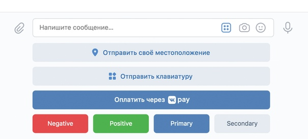
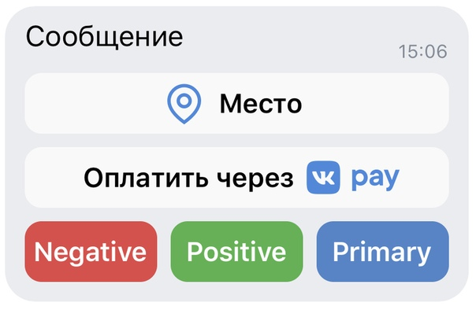
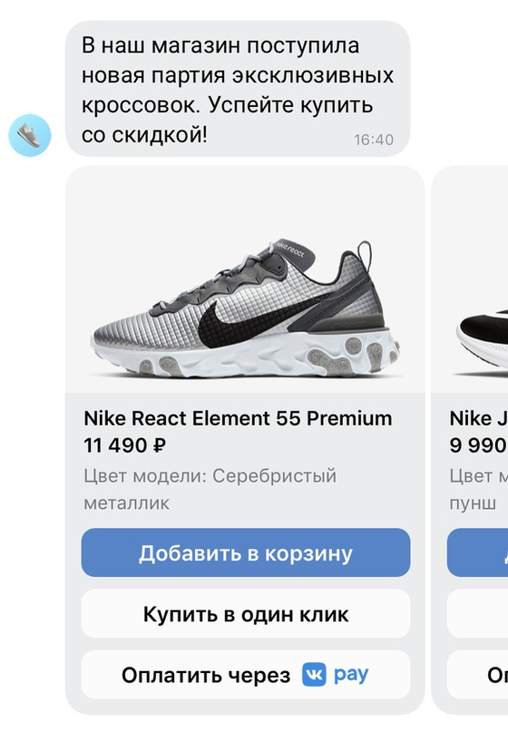
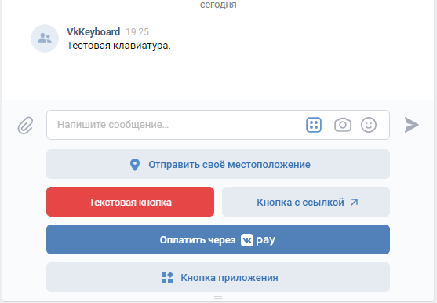
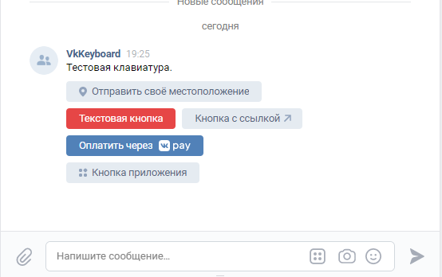
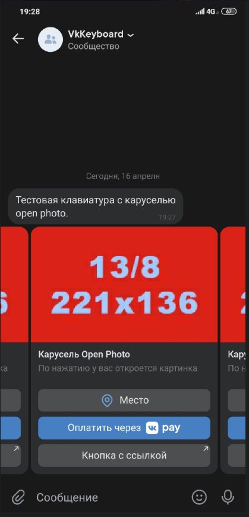

# VK Keyboard
[](https://packagist.org/packages/sally/vk-keyboard)
[](LICENCE)
[](https://github.com/Sally-Framework/vk-keyboard)
## Установка

Перед установкой рекомендую ознакомиться с последними обновлениями api вконтакте, 
а также прочитать про типы кнопок, клавиатур, каруселей и особенностей работы с api вконтакте.
[Документация клавиатур](https://vk.com/dev/bots_docs_3)

```bash
$ composer require sally/vk-keyboard
```

## Использование
На момент создания библиотеки api вконтакте поддерживает 3 типа клавиатур, а именно inline, обычная клавиатура и карусели
## Обычные

## Inline

## Карусели



Чтобы создать такие объекты кавиатур воспользуйтесь фасадом-конструктором этих объектов.

## Для создания обычной клавиатуры
```php
<?php

require '../vendor/autoload.php';

use Sally\VkKeyboard\Facade;
use Sally\VkKeyboard\Contracts\Keyboard\Button\FactoryInterface;
use Sally\VkKeyboard\Object\Keyboard\Button\Text;

$keyboard = Facade::createKeyboardBasic(function (FactoryInterface $factory) {
    return [
        [
            $factory->location([]),
        ],
        [
            $factory->text('Текстовая кнопка', ['button' => 1], Text::COLOR_RED),
            $factory->link('Кнопка с ссылкой', 'https://github.com/Sally-Framework/vk-keyboard', []),
        ],
        [
            $factory->pay('action=transfer-to-group&group_id=1&aid=10')
        ],
        [
            $factory->app('Кнопка приложения', 6979558, '-181108510', 'sendKeyboard')
        ]
    ];
});

```

Фасад сконвертирует клавиатуру в json, согласно требованиям api вконтакте
```json
{
  "one_time": true,
  "buttons": [
    [
      {
        "action": {
          "payload": "[]",
          "type": "location"
        }
      }
    ],
    [
      {
        "color": "negative",
        "action": {
          "payload": "{\"button\":1}",
          "label": "Текстовая кнопка",
          "type": "text"
        }
      },
      {
        "action": {
          "link": "https:\/\/github.com\/Sally-Framework\/vk-keyboard",
          "label": "Кнопка с ссылкой",
          "payload": "[]",
          "type": "open_link"
        }
      }
    ],
    [
      {
        "action": {
          "hash": "action=transfer-to-group&group_id=1&aid=10",
          "type": "vkpay"
        }
      }
    ],
    [
      {
        "action": {
          "app_id": 6979558,
          "owner_id": "-181108510",
          "hash": "sendKeyboard",
          "label": "Кнопка приложения",
          "type": "open_app"
        }
      }
    ]
  ]
}
```

Если отправить такую клавиатуру, то она будет отображена в таком виде


## Для Inline клавиатуры
```php
<?php

require '../vendor/autoload.php';

use Sally\VkKeyboard\Facade;
use Sally\VkKeyboard\Contracts\Keyboard\Button\FactoryInterface;
use Sally\VkKeyboard\Object\Keyboard\Button\Text;

$keyboard = Facade::createKeyboardInline(function (FactoryInterface $factory) {
    return [
        [
            $factory->location([]),
        ],
        [
            $factory->text('Текстовая кнопка', ['button' => 1], Text::COLOR_RED),
            $factory->link('Кнопка с ссылкой', 'https://github.com/Sally-Framework/vk-keyboard', []),
        ],
        [
            $factory->pay('action=transfer-to-group&group_id=1&aid=10')
        ],
        [
            $factory->app('Кнопка приложения', 6979558, '-181108510', 'sendKeyboard')
        ]
    ];
});

```

```json
{
  "inline": true,
  "buttons": [
    [
      {
        "action": {
          "payload": "[]",
          "type": "location"
        }
      }
    ],
    [
      {
        "color": "negative",
        "action": {
          "payload": "{\"button\":1}",
          "label": "Текстовая кнопка",
          "type": "text"
        }
      },
      {
        "action": {
          "link": "https:\/\/github.com\/Sally-Framework\/vk-keyboard",
          "label": "Кнопка с ссылкой",
          "payload": "[]",
          "type": "open_link"
        }
      }
    ],
    [
      {
        "action": {
          "hash": "action=transfer-to-group&group_id=1&aid=10",
          "type": "vkpay"
        }
      }
    ],
    [
      {
        "action": {
          "app_id": 6979558,
          "owner_id": "-181108510",
          "hash": "sendKeyboard",
          "label": "Кнопка приложения",
          "type": "open_app"
        }
      }
    ]
  ]
}
```



## Для каруселей
```php
<?php

require '../vendor/autoload.php';

use Sally\VkKeyboard\Facade;
use Sally\VkKeyboard\Contracts\Keyboard\Button\FactoryInterface as ButtonFactoryInterface;
use Sally\VkKeyboard\Contracts\Template\Carousel\Element\FactoryInterface as CarouselElementInterface;

$templateWithOpenPhoto = Facade::createCarousel(function (CarouselElementInterface $elementFactory, ButtonFactoryInterface $buttonFactory) {
    return [
        $elementFactory->openPhoto([
            $buttonFactory->location(['button' => 'location']),
            $buttonFactory->pay('action=transfer-to-group&group_id=1&aid=10'),
            $buttonFactory->link('Кнопка с ссылкой', 'https://github.com/Sally-Framework/vk-keyboard', []),
        ], 'Карусель Open Photo', 'По нажатию у вас откроется картинка', '-109837093_457242809'),
        $elementFactory->openPhoto([
            $buttonFactory->location(['button' => 'location']),
            $buttonFactory->pay('action=transfer-to-group&group_id=1&aid=10'),
            $buttonFactory->link('Кнопка с ссылкой', 'https://github.com/Sally-Framework/vk-keyboard', []),
        ], 'Карусель Open Photo', 'По нажатию у вас откроется картинка', '-109837093_457242809'),
        $elementFactory->openPhoto([
            $buttonFactory->location(['button' => 'location']),
            $buttonFactory->pay('action=transfer-to-group&group_id=1&aid=10'),
            $buttonFactory->link('Кнопка с ссылкой', 'https://github.com/Sally-Framework/vk-keyboard', []),
        ], 'Карусель Open Photo', 'По нажатию у вас откроется картинка', '-109837093_457242809'),
    ];
});

```

```json
{
  "elements": [
    {
      "buttons": [
        {
          "action": {
            "payload": "{\"button\":\"location\"}",
            "type": "location"
          }
        },
        {
          "action": {
            "hash": "action=transfer-to-group&group_id=1&aid=10",
            "type": "vkpay"
          }
        },
        {
          "action": {
            "link": "https:\/\/github.com\/Sally-Framework\/vk-keyboard",
            "label": "Кнопка с ссылкой",
            "payload": "[]",
            "type": "open_link"
          }
        }
      ],
      "title": "Карусель Open Photo",
      "description": "По нажатию у вас откроется картинка",
      "photo_id": "-109837093_457242809",
      "action": {
        "type": "open_photo"
      }
    },
    {
      "buttons": [
        {
          "action": {
            "payload": "{\"button\":\"location\"}",
            "type": "location"
          }
        },
        {
          "action": {
            "hash": "action=transfer-to-group&group_id=1&aid=10",
            "type": "vkpay"
          }
        },
        {
          "action": {
            "link": "https:\/\/github.com\/Sally-Framework\/vk-keyboard",
            "label": "Кнопка с ссылкой",
            "payload": "[]",
            "type": "open_link"
          }
        }
      ],
      "title": "Карусель Open Photo",
      "description": "По нажатию у вас откроется картинка",
      "photo_id": "-109837093_457242809",
      "action": {
        "type": "open_photo"
      }
    },
    {
      "buttons": [
        {
          "action": {
            "payload": "{\"button\":\"location\"}",
            "type": "location"
          }
        },
        {
          "action": {
            "hash": "action=transfer-to-group&group_id=1&aid=10",
            "type": "vkpay"
          }
        },
        {
          "action": {
            "link": "https:\/\/github.com\/Sally-Framework\/vk-keyboard",
            "label": "Кнопка с ссылкой",
            "payload": "[]",
            "type": "open_link"
          }
        }
      ],
      "title": "Карусель Open Photo",
      "description": "По нажатию у вас откроется картинка",
      "photo_id": "-109837093_457242809",
      "action": {
        "type": "open_photo"
      }
    }
  ],
  "type": "carousel"
}
```



## Примеры
Более детальные примеры представлены [здесь](examples).
